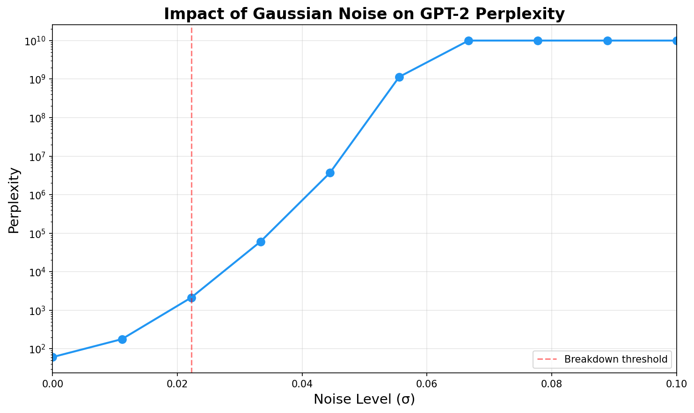
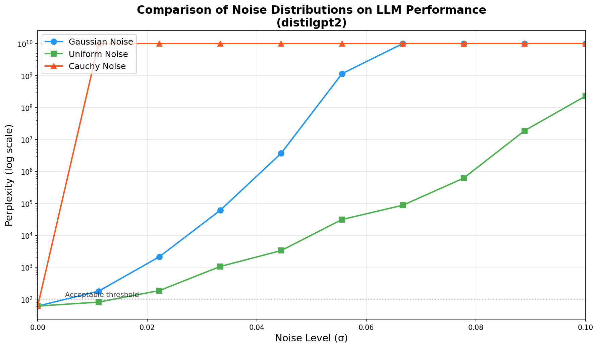
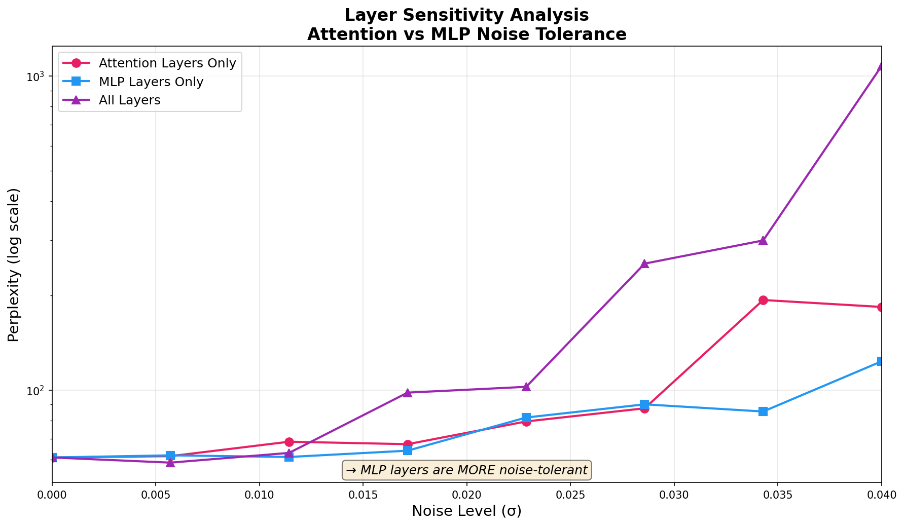
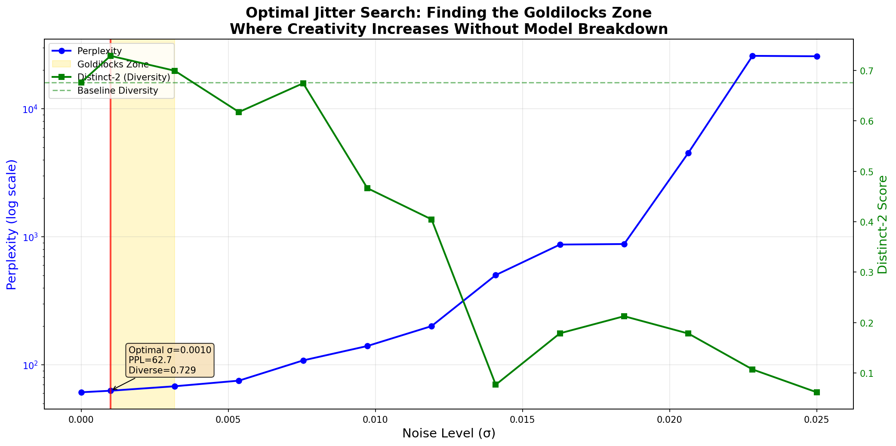
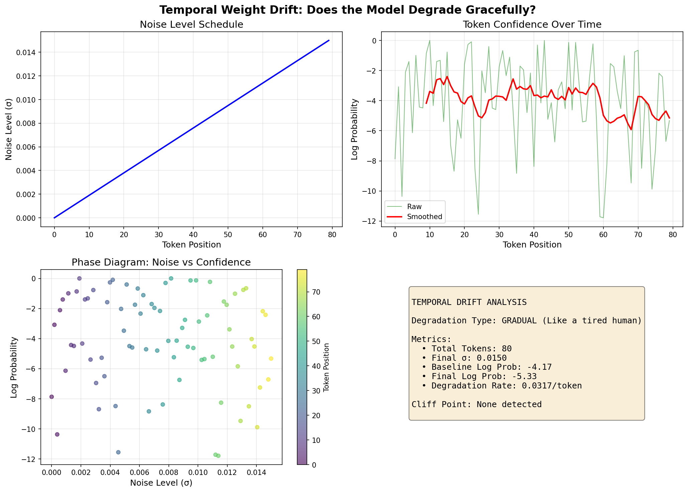
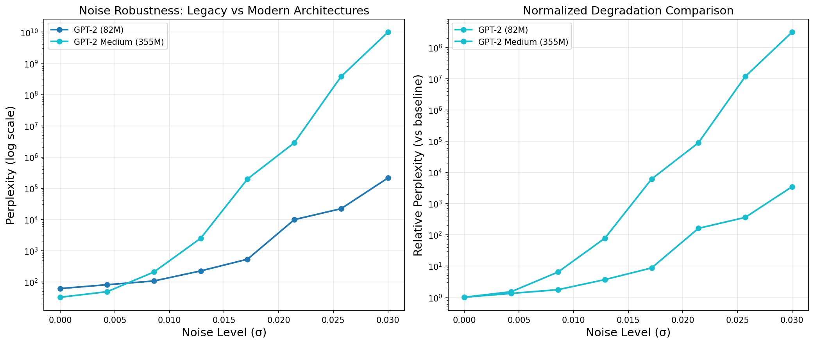

# 🧠 Noisy Neural Network

> Simulating Analog Hardware Thermal Drift Effects on Large Language Models

[](https://www.python.org/downloads/)
[](https://pytorch.org/)
[](https://huggingface.co/transformers/)
[](LICENSE)

---

## 📋 Overview

This project demonstrates how **analog hardware noise** (thermal drift, quantization errors, manufacturing variations) affects Large Language Model performance. By injecting controlled noise into model weights, we can observe the relationship between:

- **Noise Level (σ)** → The magnitude of weight perturbation
- **Perplexity** → Model's "accuracy" (lower is better)
- **Entropy** → Model's "creativity/uncertainty" (measured in bits)

### Key Insight

There exists a critical noise threshold where LLM output transitions from:

1. **Coherent text** → Baseline performance
2. **Creative jitter** → Slightly degraded but interesting variations
3. **Repetitive patterns** → Model stuck in loops
4. **Complete gibberish** → Total breakdown

---

## 🚀 Quick Start

### Installation

```bash
# Clone the repository
git clone https://github.com/pranshug2704/NoisyNeuralNetwork.git
cd NoisyNeuralNetwork

# Create virtual environment (optional but recommended)
python -m venv venv
source venv/bin/activate  # On Windows: venv\Scripts\activate

# Install dependencies
pip install -r requirements.txt
```

### Run the Simulation

```bash
# Basic run with default settings (distilgpt2, Gaussian noise)
python thermal_noise_simulation.py

# Custom configuration
python thermal_noise_simulation.py \
    --model gpt2 \
    --noise_type gaussian \
    --max_noise 0.1 \
    --n_levels 10 \
    --prompt "The future of artificial intelligence is"
```

---

## 📊 Results

### Noise Level vs. Perplexity (Gaussian Noise)

| Noise (σ) | Perplexity | Entropy (bits) | Quality Assessment |
| --------- | ---------- | -------------- | ------------------ |
| 0.000     | 60.96      | 3.48           | ✅ Coherent        |
| 0.0125    | 164.14     | 4.63           | ⚡ Creative Jitter |
| 0.025     | 5,074      | 1.24           | ⚠️ Degraded        |
| 0.0375    | 45.5M      | 0.53           | ❌ Gibberish       |
| 0.050     | 166.8M     | 0.54           | ❌ Gibberish       |

### Generated Visualizations

<p align="center">
  
</p>

<p align="center">
  
</p>

### Text Degradation Examples

**σ = 0.0 (Baseline - Coherent)**

> "The future of artificial intelligence is much clearer, as they are already discovering and applying new technologies and technologies. The development of these technologies has been driven by advances..."

**σ = 0.0125 (Creative Jitter)**

> "The future of artificial intelligence is bleak. But what drives the industry into a dangerous position is a sense of the sense that the world around us is shifting from a safe haven..."

**σ = 0.025 (Degraded - Repetitive)**

> "The future of artificial intelligence is coming and coming and coming and coming and coming and coming and coming..."

**σ = 0.05 (Gibberish)**

> "The future of artificial intelligence is optimtrehensive optimtrehensive optimtrehensive optimtrehensive..."

---

## 🏗️ Architecture

```
NoisyNeuralNetwork/
├── thermal_noise_simulation.py  # Main CLI script
├── noise_distributions.py       # Modular noise injection system
├── evaluation.py                # Perplexity & entropy utilities
├── layer_sensitivity.py         # Experiment A: Attention vs MLP
├── optimal_jitter.py            # Experiment B: Goldilocks zone
├── noise_aware_training.py      # Experiment C: QAT-style training
├── generate_graphs.py           # Comparison graph generation
├── requirements.txt             # Dependencies
├── images/                      # Generated visualizations
└── README.md
```

---

## 🔬 Advanced Experiments

### A. Layer Sensitivity Analysis

**Question**: Are Attention layers or MLP layers more tolerant to noise?

```bash
python layer_sensitivity.py --max_noise 0.04 --n_levels 8
```

**Key Finding**: MLP layers are slightly MORE noise-tolerant than Attention layers:

- Attention crosses PPL=100 at σ ≈ 0.034
- MLP crosses PPL=100 at σ ≈ 0.040

<p align="center">
  
</p>

**Implication**: For hybrid analog/digital chips, consider **Digital Attention + Analog MLP**.

---

### B. Optimal Jitter Search (Goldilocks Zone)

**Question**: Is there a noise level where the model becomes MORE creative without breaking?

```bash
python optimal_jitter.py --search_range 0.001 0.025 --n_points 12
```

**Key Finding**: Goldilocks zone exists at **σ = 0.001**:

- Diversity (Distinct-2): +7.8% improvement
- Perplexity: only +2.8% degradation

<p align="center">
  
</p>

---

### C. Noise-Aware Fine-tuning

**Question**: Can we train the model to be robust to noise (like Quantization-Aware Training)?

```bash
python noise_aware_training.py --noise_level 0.01 --epochs 1 --max_samples 500
```

This module injects noise during the forward pass, teaching the model to store information redundantly.

---

### D. Temporal Noise (Weight Drift)

**Question**: Does the model degrade gracefully (like a tired human) or suddenly snap?

```bash
python temporal_drift.py --total_tokens 100 --end_sigma 0.02
```

**Key Finding**: **GRADUAL degradation** - the model behaves like a tired human, not a sudden cliff!

<p align="center">
  
</p>

Supports multiple drift schedules: `linear`, `exponential`, `step`, `sine` (thermal cycling).

---

### E. Architecture Scaling (GPT-2 vs LLaMA-3)

**Question**: Are larger/modern models more or less noise-tolerant?

```bash
# GPT-2 comparison only (no GPU required)
python llama_scaling.py --n_levels 8 --max_noise 0.03

# Include LLaMA-3/Mistral (requires CUDA GPU)
python llama_scaling.py --include_modern
```

**Key Finding**: **Smaller models are MORE noise-tolerant!**

- GPT-2 (82M): 2x PPL at σ = 0.0129
- GPT-2 Medium (355M): 2x PPL at σ = 0.0086

<p align="center">
  
</p>

### Module Details

#### `noise_distributions.py`

Implements a **Strategy Pattern** for modular noise injection:

```python
from noise_distributions import inject_thermal_noise, GaussianNoise

# Inject 5% Gaussian noise into model weights
inject_thermal_noise(model, noise_level=0.05, noise_type="gaussian")
```

**Available Noise Types:**
| Type | Formula | Use Case |
|------|---------|----------|
| `gaussian` | W + N(0, σ²) | Thermal noise in analog circuits |
| `uniform` | W + U(-a, a) | Quantization noise in DACs |
| `cauchy` | W + Cauchy(0, γ) | Heavy-tailed outlier events |

#### `evaluation.py`

Provides metrics for model assessment:

```python
from evaluation import compute_perplexity, generate_text_samples, compute_output_entropy

# Compute perplexity on validation text
ppl = compute_perplexity(model, tokenizer, validation_text, device)

# Generate text samples
samples = generate_text_samples(model, tokenizer, prompt, device, n_samples=3)

# Measure output entropy
entropy = compute_output_entropy(model, tokenizer, prompt, device)
```

---

## 🔧 Extending the Framework

### Adding Custom Noise Distributions

1. Create a new class inheriting from `NoiseDistribution`:

```python
from noise_distributions import NoiseDistribution, NOISE_REGISTRY

class LaplacianNoise(NoiseDistribution):
    """Laplacian noise for modeling double-exponential errors."""

    def sample(self, shape, scale, device):
        # Laplacian via inverse CDF
        u = torch.rand(shape, device=device) - 0.5
        return scale * torch.sign(u) * torch.log(1 - 2 * torch.abs(u))

    @property
    def name(self):
        return "Laplacian"

# Register the new distribution
NOISE_REGISTRY["laplacian"] = LaplacianNoise
```

2. Use it in the simulation:

```bash
python thermal_noise_simulation.py --noise_type laplacian
```

---

## 📈 CLI Options

| Argument       | Default                                    | Description                    |
| -------------- | ------------------------------------------ | ------------------------------ |
| `--model`      | `distilgpt2`                               | HuggingFace model name         |
| `--noise_type` | `gaussian`                                 | Noise distribution type        |
| `--max_noise`  | `0.1`                                      | Maximum noise level (σ)        |
| `--n_levels`   | `10`                                       | Number of noise levels to test |
| `--prompt`     | "The future of artificial intelligence is" | Generation prompt              |
| `--device`     | `auto`                                     | Compute device (cuda/mps/cpu)  |
| `--output`     | `noise_vs_perplexity.png`                  | Output plot path               |

---

## 🔬 Technical Background

### The Noise Injection Formula

For each Linear layer weight matrix W:

$$W_{noisy} = W + \mathcal{N}(0, \sigma^2)$$

Where σ represents the "Thermal Temperature" parameter. Higher σ → more analog hardware degradation.

### Why Perplexity Explodes

When σ approaches the model's weight standard deviation (~0.14 for GPT-2):

1. Weight perturbations exceed original weight magnitudes
2. Attention patterns become corrupted
3. Softmax distributions collapse to single tokens (repetition)
4. Eventually outputs become random token sequences

### Entropy Paradox

Interestingly, entropy _decreases_ at high noise levels because the model becomes **extremely confident** in wrong predictions (collapsed attention), rather than uncertain across many tokens.

---

## 📚 References

- [Analog AI and the Future of Computing](https://research.ibm.com/blog/analog-ai-chips)
- [GPT-2: Language Models are Unsupervised Multitask Learners](https://openai.com/research/better-language-models)
- [Perplexity as a Language Model Metric](https://huggingface.co/docs/transformers/perplexity)

---

## 📄 License

MIT License - feel free to use this for research or educational purposes!

---

## 🤝 Contributing

Contributions welcome! Ideas for extensions:

- [ ] Add more noise distributions (Poisson, Student-t, Laplacian)
- [ ] Support for larger models (LLaMA, Mistral)
- [x] ~~Layer-specific noise injection~~ (Implemented: `layer_sensitivity.py`)
- [x] ~~Noise-aware fine-tuning experiments~~ (Implemented: `noise_aware_training.py`)
- [ ] Web UI for interactive exploration
- [ ] Per-layer noise scheduling (noise annealing)
